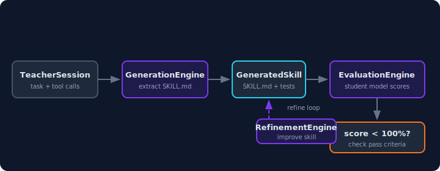

<p align="center">
  
</p>

<h1 align="center">Thulpoff</h1>

<p align="center">
  Skill distillation for AI agents.<br>
  Generate, evaluate, and refine SKILL.md files using teacher-student model distillation.
</p>

<p align="center">
  
</p>

---

**Thulpoff** captures domain expertise from capable "teacher" models and encodes it into structured skill files that enhance smaller "student" models. It implements the [upskill](https://github.com/huggingface/upskill) paradigm in Rust — generation, evaluation, and iterative refinement of `SKILL.md` files compatible with [Claude Code](https://docs.anthropic.com/en/docs/claude-code/skills), [thulp](https://github.com/dirmacs/thulp), or any agent supporting the skill format.

Built by [DIRMACS](https://dirmacs.com).

## Install

```bash
cargo install thulpoff-cli
```

```toml
# Or as a library
[dependencies]
thulpoff-core = "0.1"
thulpoff-engine = "0.1"
thulpoff-provider = "0.1"
```

## Why Thulpoff?

Small models can match large models on specific tasks — if given the right instructions. But writing those instructions is manual and brittle. Thulpoff automates the loop:

1. **Teacher demonstrates** — a capable model solves a task
2. **Skill extraction** — solution patterns are distilled into SKILL.md
3. **Test generation** — test cases validate the skill works
4. **Student evaluation** — smaller models are scored with the skill
5. **Refinement** — failures feed back to improve the skill

The teacher teaches, the student learns, the skill improves.

## Workspace (4 crates)

| Crate | What | Tests |
|-------|------|-------|
| **thulpoff-core** | Types, traits, LlmProvider, CompletionRequest/Response | 8 |
| **thulpoff-provider** | AnthropicProvider (Claude API), NimProvider (NVIDIA NIM) | 8 |
| **thulpoff-engine** | GenerationEngine, EvaluationEngine, RefinementEngine | 14 |
| **thulpoff-cli** | generate, eval, refine, list commands | 6 |

## Quick Start

### Generate a skill

```bash
thulpoff generate \
  "Write an optimized sorting algorithm" \
  --model claude-opus-4-6 \
  --provider anthropic \
  --output ./skills/
```

### Evaluate with a student model

```bash
thulpoff eval \
  ./skills/optimized-sorting/SKILL.md \
  --model mistralai/mistral-small-24b-instruct-2501 \
  --provider nim
```

### Refine based on failures

```bash
thulpoff refine \
  ./skills/optimized-sorting/SKILL.md \
  --model claude-opus-4-6 \
  --provider anthropic
```

### List available skills

```bash
thulpoff list --dir ./skills/
```

## Providers

| Provider | Models | Auth |
|----------|--------|------|
| `anthropic` | Claude Opus, Sonnet, Haiku | `ANTHROPIC_API_KEY` |
| `nim` | Mistral, Llama, Nemotron via NVIDIA NIM | `NVIDIA_API_KEY` |
| `openai` | GPT-4, GPT-3.5, local models via OpenAI-compatible API | `OPENAI_API_KEY` |

## Architecture

```
thulpoff/
  crates/
    thulpoff-core/      # types, traits, LlmProvider interface
    thulpoff-provider/  # Anthropic + NIM provider implementations
    thulpoff-engine/    # generation, evaluation, refinement engines
    thulpoff-cli/       # clap CLI with provider selection
  docs/                 # architecture, CLI reference, types, roadmap
  reference/            # upskill Python reference (temporary)
```

### The Distillation Loop

<p align="center">
  
</p>

## Development

```bash
cargo build --workspace
cargo test --workspace
cargo clippy --workspace -- -D warnings
```

## Ecosystem

| Project | What |
|---------|------|
| [thulp](https://github.com/dirmacs/thulp) | Execution context engineering — tool discovery, validation, workflows |
| [ares](https://github.com/dirmacs/ares) | Agentic retrieval-enhanced server |
| [pawan](https://github.com/dirmacs/pawan) | CLI coding agent |
| [eruka](https://eruka.dirmacs.com) | Context intelligence engine |
| [dstack](https://github.com/dirmacs/dstack) | Development stack — memory, deploy, autonomous loops |

### Tip: pair with ralph-loop for high-signal distillation

Autonomous agent sessions driven by the [ralph-loop pattern](https://github.com/dirmacs/dstack/tree/main/plugin/skills/ralph-loop)
from dstack produce exceptionally rich session traces — hours of
continuous tool use, hundreds of commits, dozens of distinct sub-problems
solved. These are ideal inputs for thulpoff's GenerationEngine because:

1. The teacher model has already done the hard work (not a toy prompt)
2. The action traces contain real tool patterns, not synthetic examples
3. Test cases can be extracted from the commits themselves
4. Baseline comparison reveals the exact skill value delta

```bash
# After a ralph-loop session completed
pawan distill --refine --student-model mistral-small-24b
```

Pawan's distill command wraps thulpoff's full distill→eval→refine→eval
loop, using the ralph session as the teacher trace.

## Inspiration

- [HuggingFace upskill](https://github.com/huggingface/upskill) — the original Python implementation
- [Claude Code Skills](https://docs.anthropic.com/en/docs/claude-code/skills) — the SKILL.md format
- [We Got Claude to Build CUDA Kernels](https://huggingface.co/blog/open-source-llms-as-agents-cuda-kernel) — the approach demonstrated

## License

MIT OR Apache-2.0
